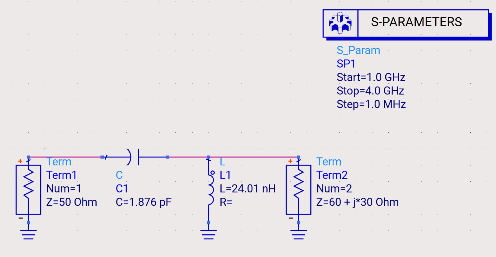
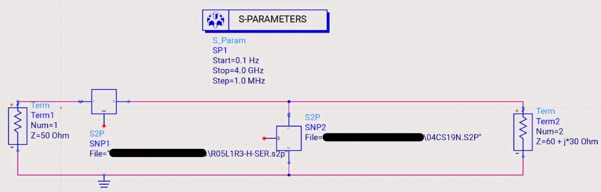
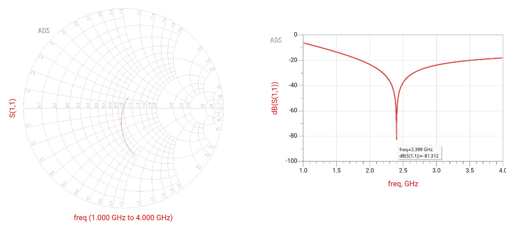
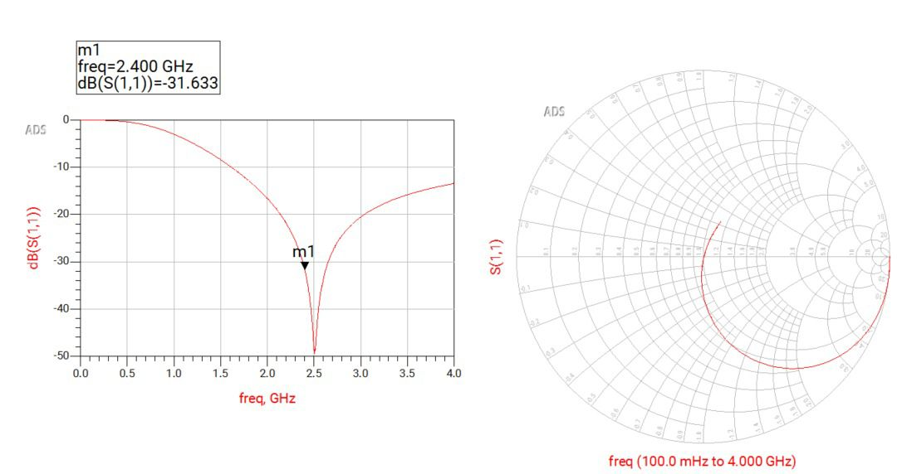

# RF Impedance Matching Optimization (2.4 GHz)

## Overview
A MATLAB-based algorithm designed to optimize Low-Pass and High-Pass L-network impedance matching circuits at 2.4 GHz. 

Standard analytical calculations assume ideal L and C components, which often fail at microwave frequencies due to parasitic effects (such as ESL in capacitors and Cp in inductors). To address this, the algorithm performs a 2D grid search using measured S-parameters (.s2p files) from commercial manufacturers, identifying the optimal real-world component combination for a given complex load ($60 + j30 \text{ } \Omega$).

## Repository Structure
* **`L_matching_Lowpass.m`**: MATLAB script optimizing the Low-Pass matching network.
* **`Lmatchinghighpass.m`**: MATLAB script optimizing the High-Pass matching network.
* **`*.s2p` files**: Real-world manufacturer S-parameter data from Coilcraft (0402CS series) and Johanson Technology (R05L series).
* **`*.jpeg` files**: Verification and simulation plots from Keysight ADS and the theoretical reference calculator.

## Workflow
1. **Data Parsing**: Loads component S2P files and extracts Y-parameters to evaluate shunt components.
2. **Grid Search**: Sweeps thousands of physical inductor and capacitor combinations.
3. **Optimization**: Minimizes the input reflection coefficient (S11) at the 2.4 GHz target frequency.
4. **Validation**: Verifies the selected components using Keysight ADS circuit simulations under realistic grounding conditions.

## Results & Simulations

### Keysight ADS Circuit Layouts (High-Pass)
Comparison between the ideal components layout and the real-world layout using manufacturer S-parameter blocks.

| Ideal Components Layout | Real-World Layout (S2P) |
|:---:|:---:|
|  |  |

### S11 Performance & Smith Chart (High-Pass)
Final ADS simulations demonstrated excellent matching with S11 < -19 dB (VSWR ≈ 1.25) at the target frequency, accounting for component parasitics.

| Ideal Matching Results | Real Matching Results |
|:---:|:---:|
|  |  |
